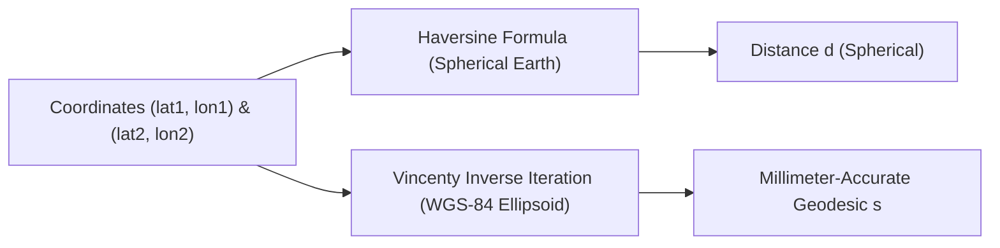

# Geodesy & Distance Engine Skill

Exact ellipsoidal and spherical great-circle geodesic solvers adhering strictly to WGS-84 ellipsoid parameters.

## Features
- **100% Python Standard Library**: WGS-84 constants.
- **Millimeter Precision**: Vincenty inverse iterative solver down to \(10^{-12}\) convergence.
